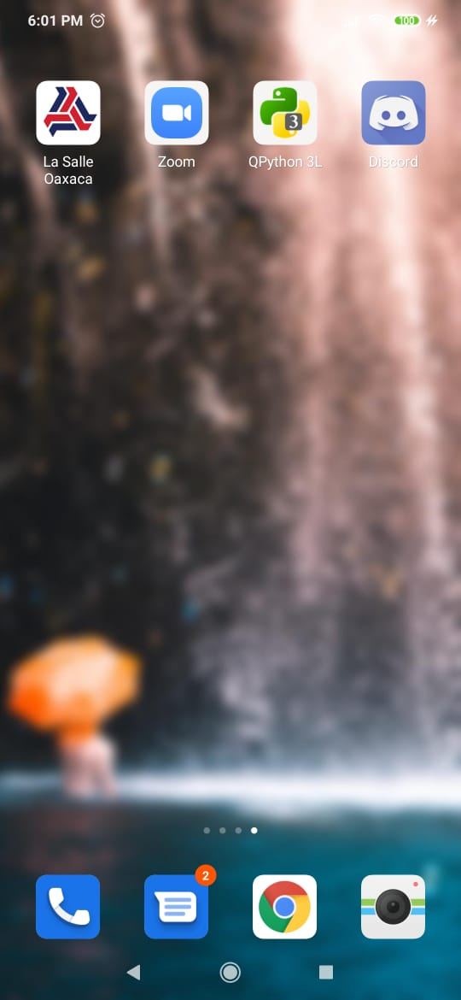
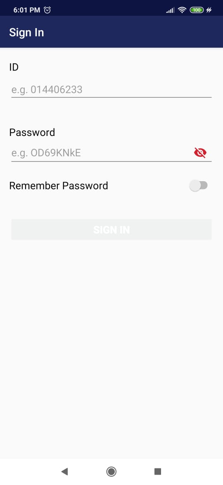

# La Salle Oaxaca: App

This repository contains the Android app for "ULSA Oaxaca", which has the porpouse of improving the navegation of La Salle's portal.

This program in it's majority is free software; it can be redistribuited or modified under the GNU General Public License v2 terms as stated by the Free Software Fundation, with the simple modification of this program it is ABSOLUTELY FORBIDDEN ANY USE, MODIFICATION, DISTRIBUTION OR REDISTRIBUTION from a person acting on behalf of La Salle's network. This limitation does not apply to students for obvious reasons.

This program is distributed with hopes of being useful, but without any guarentees; without any guarentee of being profitable. Read the GNU General Public License for more details.

You should recieve a copy of the GNU General Public License along with this program. If this is not the case, refer [http://www.gnu.org/licenses](http://www.gnu.org/licenses/).

### Installation
---
To compile the app you should download and import this proyect to Android Studio or similar.
If the previous step is not possible, there is an existing precompiled file in app/open/release/

### About trademark
---
WeAreMagic, is the developer of this app and he is in no way affiliated to La Salle nor does he have plans of being. This app was developed by an student to be helpful to other studentes, and is my every intention for it to remain this way. The app, as it is presented, is free and open, and thanks to the fact that most of it is open source (almost everything) any student may use it, modify it to his or her convinience.